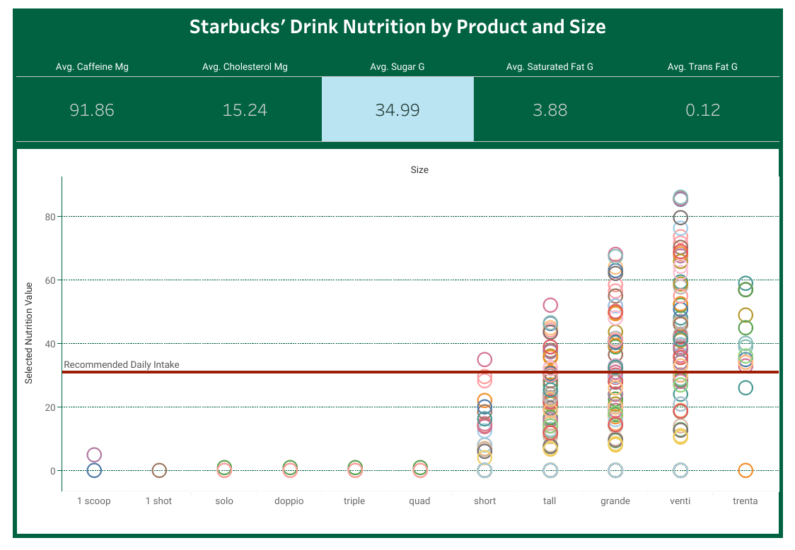
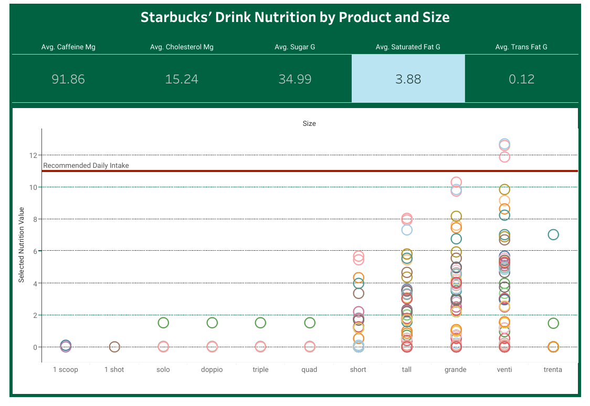
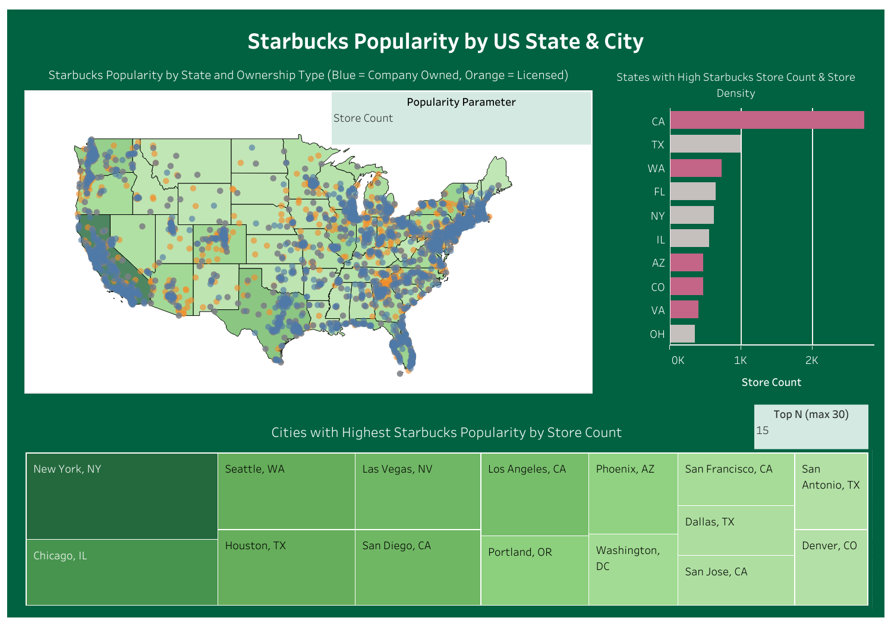
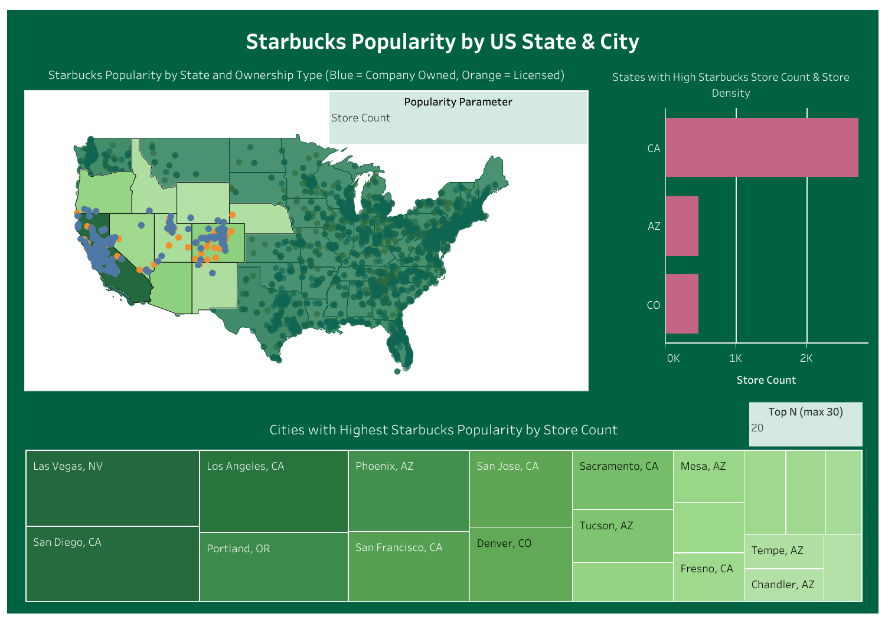
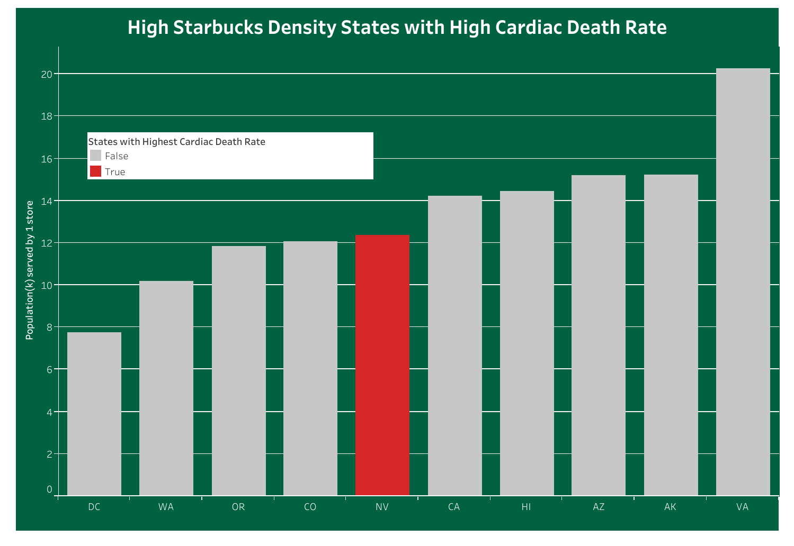
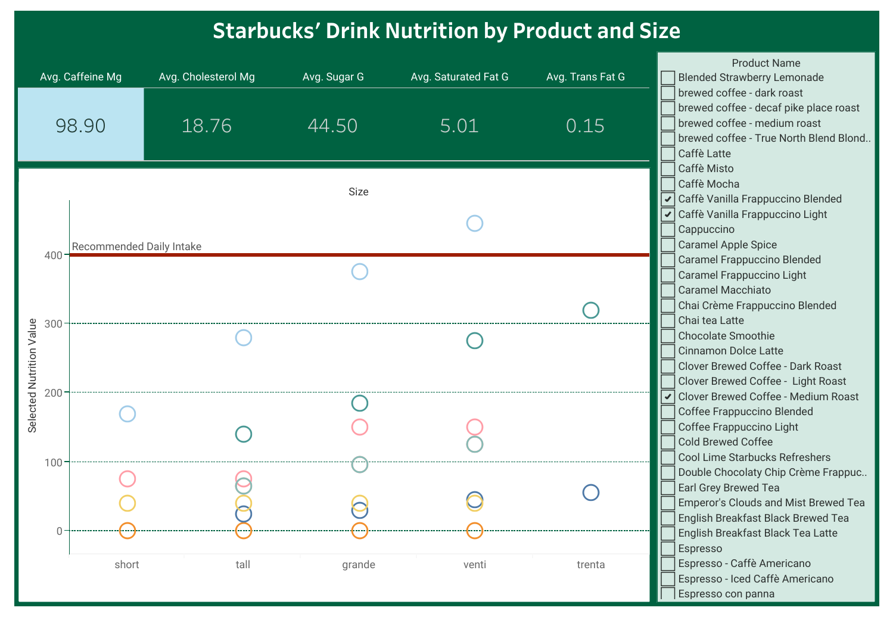

# Tableau Dashboards: Starbucks Popularity in the USA and Drinks' Nutrition Comparison
###### Author: Avianna Bui 

[Link to Tableau dashboard](https://public.tableau.com/shared/F7MFBWZ9P?:display_count=n&:origin=viz_share_link) 

## Introduction and Data Context
Starbucks is the largest coffee chain in the United States regarding physical units, with over 15,000 stores in the U.S. in 2022 (Statista Research Department, 2023). Due to this immense popularity, I started the project with the overarching goal to examine the coffee giant's influence on the quality of life in the U.S.
 
Since the Starbucks API is not public, I resorted to working with publicly available datasets I found online. I used [Kaggle’s Starbucks Store Location 2023](https://www.kaggle.com/datasets/omarsobhy14/starbucks-store-location-2023/data) to create a dashboard examining Starbucks’ popularity by U.S. states and cities, which I joined with the [2019 Census US Population Data By State](https://www.kaggle.com/datasets/peretzcohen/2019-census-us-population-data-by-state) on Kaggle to calculate the store density metric for my analysis. 

I also used the [Official Starbucks Nutritional Dataset](https://github.com/rfordatascience/tidytuesday/blob/master/data/2021/2021-12-21/readme.md) on Tidy Tuesday, which contains nutritional information on every Starbucks’ drinks found in the Starbucks Coffee Company Beverage Nutrition Information, to create a dashboard in which users can compare nutritional values of different Starbucks’ drinks. Finally, I included a Statista’s dataset on state-wise [Heart Disease Death Rates in the United States in 2021](https://www.statista.com/statistics/320799/top-us-states-by-heart-disease-deaths/) to explore the tentative relationship between Starbucks’ popularity and cardiovascular health. Circulatory health was selected as a measure for analysis because based on my exploratory data analysis, which I will further discuss in the next section, many Starbucks drinks are unhealthy for our heart. Combined with the fact that heart disease is the leading cause of death in the U.S. (CDC, 2023), investigating Starbucks’ popularity and nutritional values might help inform people within highly popular Starbucks locations to be more conscious about their drink selections. 

## Data Story and Technical Discussion

  

  

  

  

  

  

## Summary of Findings

## Limitations 

## Bibliography
Centers for Disease Control and Prevention. (2023). FastStats - Leading Causes of Death. Accessed December 23, 2023. https://www.cdc.gov/nchs/fastats/leading-causes-of-death.htm 

Cohen, P. (2020). 2019 Census US Population Data By State. Retrieved November 21, 2023. https://www.kaggle.com/datasets/peretzcohen/2019-census-us-population-data-by-state 

Elflein, J. (2023). Heart disease death rates in the United States in 2021, by state. Retrieved December 2, 2023. https://www.statista.com/statistics/320799/top-us-states-by-heart-disease-deaths/

Sobhy, O. (2023). Starbucks Store Location 2023: Coffee Giant Growth. Retrieved October 30, 2023. https://www.kaggle.com/datasets/omarsobhy14/starbucks-store-location-2023/data

Statista Research Department. (2023). Number of units of leading coffee shop chains in the U.S. 2022. Accessed December 23, 2023. https://www.statista.com/statistics/920174/number-of-units-of-selected-leading-coffee-house-and-cafe-chains-in-the-us/

Tidy Tuesday. (2021). Official Starbucks Nutritional dataset from Starbucks Coffee Company Beverage Nutrition Information. Retrieved October 15, 2023. https://github.com/rfordatascience/tidytuesday/blob/master/data/2021/2021-12-21/readme.md 
